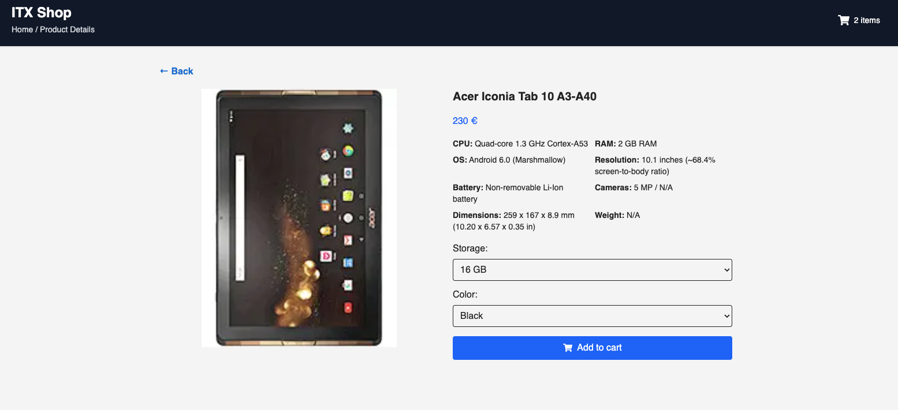

# ITX Shop — React Next App

This is a single-page application built with **React** and **Next.js**.

The application consists of two views:

- Main Product Listing View
- Product Details View

---

## Tech Stack

- **React 19** with Vite
- **Next v15**
- **Axios** for API requests
- **Tailwinds** for styling
- **React Context + useReducer** for cart state
- **Custom Hook (`useCache`)** for client-side caching
- **React Toastify** for notifications
- **ESLint + Prettier** for code quality
- **Responsive design**

---

## Setup

```bash
# Install dependencies
npm install

# Start development server
npm run dev

# Build for production
npm run build

```

---

## Architecture & Key Decisions

### State Management

- Global cart state handled with **Context + useReducer**
- Exposes clear actions: `addToCart`, `setCount`, ...

### Caching

- `useCache` custom hook caches API responses in **localStorage** with a valid time of 1 hour
- Prevents redundant API calls and improves performance

### API Layer

- Centralized `axios` instance for all network requests
- Uses `withCredentials: true` to maintain cart session via **cookies**
- Local **proxy setup** avoids CORS issues in development and preview environments

---

## Screenshots

### Home / Product List


### Product Details Page



### Toast Notification on Add to Cart


---

## Author

**José Ángel Hernández**  
Fullstack Developer  
GitHub: [@joseanher81](https://github.com/joseanher81)
